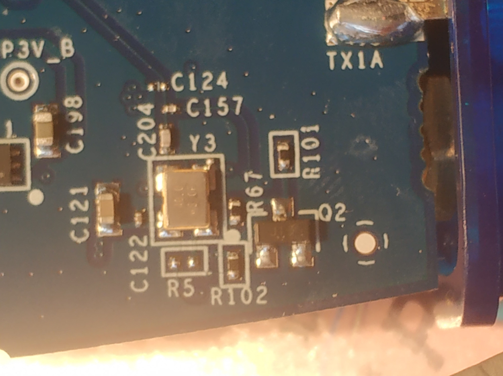

# pluto-revD-tcxo-replacement

Original source:

https://s-taka.org/plutosdr-revision-c/


https://blog-goo-ne-jp.translate.goog/osqzss/e/02041fe5dc9f4e204f7243fc0cda03ed?_x_tr_sl=auto&_x_tr_tl=sk&_x_tr_hl=sk&_x_tr_pto=wapp

# List of required HW

Desoldering tape:
https://www.aliexpress.com/item/1005003252802464.html?spm=a2g0o.order_list.order_list_main.5.3bfa1802rCCLSM

Heat resistant polyimide tape:
https://www.aliexpress.com/item/1005001382622258.html?spm=a2g0o.order_list.order_list_main.10.3bfa1802rCCLSM

Precision tweezers -pinzete
https://www.aliexpress.com/item/1005004223074659.html?spm=a2g0o.order_list.order_list_main.31.3bfa1802rCCLSM

Soldering station with heater (400-500"C)
https://www.aliexpress.com/af/soldering-station-smd.html?d=y&origin=n&SearchText=soldering+station+smd&catId=0&spm=a2g0o.detail.1000002.0&initiative_id=SB_20221222215521

soldering paste, I prefer one wit Ag. 
https://www.aliexpress.com/item/1005004654324980.html?spm=a2g0o.order_list.order_list_main.5.22fe1802wc04Tj

Oscillator  TG2520SMN 40.0000M-ECGNNM3 (EPSON)


# Procedure

Oscillator is located on back side of pluto device. The pcb contains white dot which is important for oscillator position. The same dot is also on oscillator part.


Use the heat resistant tape and create a mesh next to the oscilator.  Then use desoldering station. I was not successfull with heater bellow 200"C and the success come with about 480"C. With tweezers I have removed old oscilator.


After removing of old oscillator use desoldering tape with soldering tips and remove old tin from pcb. I did not done it in first try and parts where not align and I have to desolder new osicillator :(. Add add some small amount of thin soldering paste on pcb afterwards. Place the smd oscillator on soldering paste and pcb. 


Use the heat station to distribute heat on soldering paste. I used 350"C and air flow in range of 10%. I recommend to keep heat resistant tape on pcb during soldering. It prevents from damage of other parts and does not allow soldering paste to move to unwanted direction.


It is huge help to have electronic microsope or magnify glasses during procedure. I just use black pen marker to create more visible dot on smd oscillator for better aligment.

# Result
In the first test device seems to work, but it require some experience to provide feedback. Precision is now 100x better.
With 20ppm and 1Ghz the freq. difference could be aroung 20Khz. Current chip is in range 0.2ppm, but probably this will change each year a little.

```
Frequency_difference =  ( Wished_Frequency_in_Hz  * PPM_peak_variation_+- ) / 10x6

Band 100 Mhz
20ppm =>    2.0 Hz
0.2 ppm =>  0.18 Hz

Band 900 Mhz
20ppm =>   18.0 Hz
0.2 ppm =>  0.02 Hz


 Band 1GHZ
20ppm =>    20.0 Hz
0.2 ppm =>   0.2 Hz

Band  2GHZ
20ppm =>    40.0 Hz
0.2 ppm =>   0.4 Hz

Band  3GHZ
20ppm =>    60.0 Hz
0.2 ppm =>   0.6 Hz
```


Base on japan article former osicillator was reponsible for switch to provide external clock signal. With the replacement the external clock is not available any longer => No Leo Bodnar or similar solution.

# Tunning

After running some hours I identify there is a little jump in precision. 
In my case correction was about 67 Hz in formar chip which have no relation to current.

```
# iio_attr -C
IIO context with 8 attributes:
hw_model: Analog Devices PlutoSDR Rev.C (XXXXX-AD9364)
hw_model_variant: 1
hw_serial: XXXXXXXXXXXXXXXXXXXXXXXXXXXXXXXXXXXXXXXXXX
fw_version: v0.35
ad9361-phy,xo_correction: 40000067
ad9361-phy,model: ad9364
local,kernel: 5.10.0-98231-xxxxxxxxxxxxx
```


I have correct it as follows
```
# fw_printenv | grep correction
# no output

fw_setenv xo_correction 40000000
# fw_printenv | grep correction
xo_correction=40000000

reboot

```

With the new corrected frequency the device accurancy was almost perfect in single side band test.
